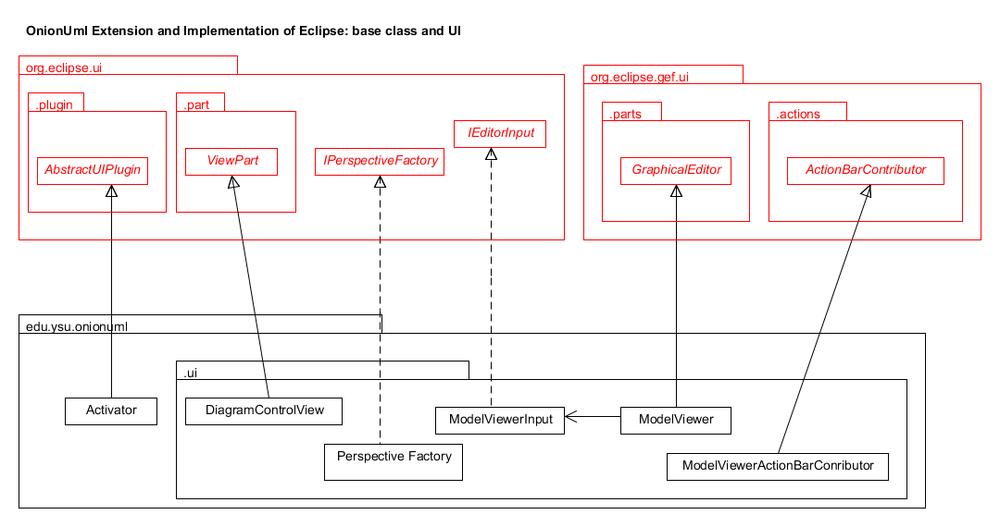
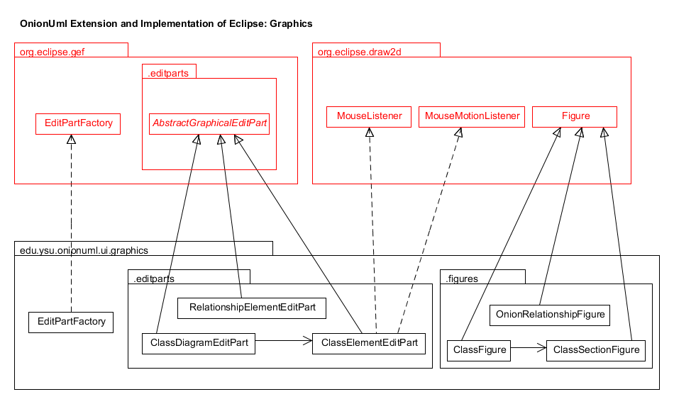
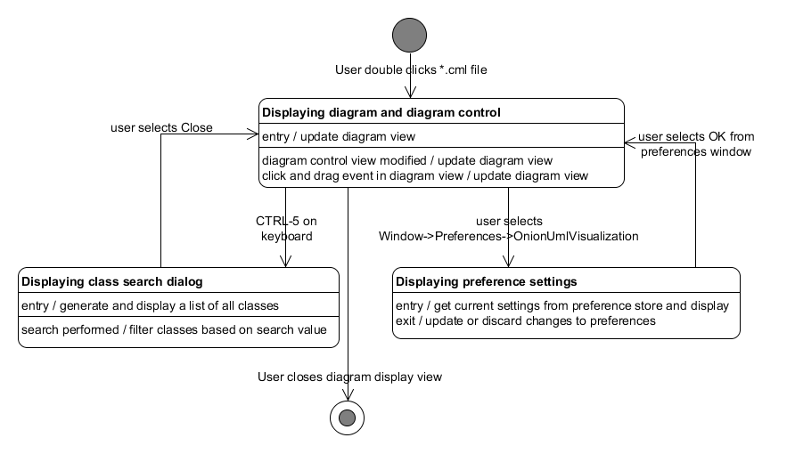
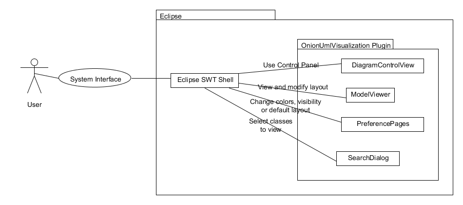

# Final System Design #
---
### Table of Contents ###
1. UML Class Diagrams
	* System overview
	* UI extension of Eclipse
	* Graphics extension of Eclipse
	* Reverse-engineered core classes view
2. UML Sequence Diagrams
	* Use Case 4 - Changing Preferences
	* Use Case 6 - Opening and Closing The UML Model View
3. UML Statechart Diagrams
	* System overview
4. Physical Architectural Model
	* System overview
	

## UML Class Diagrams ##

### System Overview ###

### Shows how the onionuml base class and ui package extend and implement Eclipse libraries ###

- **AbstractUIPlugin** - Abstract base class for plug-ins that integrate with the Eclipse platform UI

- **ViewPart** - Abstract base implementation of all workbench views

- **IPerspectiveFactory** - Generates the initial page layout and visible action set for a page

- **GraphicalEditor** - Creates an Editor containing a single GraphicalViewer as its control. 

- **ActionBarContributor** - Contributes actions to the workbench

***
### Shows how the onionuml.ui.graphics package extends and implements Eclipse libraries ###

- **EditPartFactory** - Creates new EditParts

- **EditParts** - the building blocks of GEF Viewers. As the Controller, an EditPart ties the application's model to a visual representation. EditParts are responsible for making changes to the model. EditParts typically control a single model object or a coupled set of object. Visual representations include Figures and TreeItems. Model objects are often composed of other objects that the User will interact with. Similarly, EditParts can be composed of or have references to other EditParts. 

- **AbstractGraphicalEditPart** - the default implementation for GraphicalEditPart, which is a specialized EditPart for use with graphical viewers.
- **GraphicalEditParts** - specialized EditParts for use with graphical viewers

- **Figure** - The base implementation for graphical figures

***
### Class model for onionuml core classes ###

---

##UML Sequence Diagrams##

### Use Case 4 - Changing Preferences ###

**Notes**

DiagramGraph.updateGraph() uses ClassElementGraphicalModel and RelationshipElementGraphicalModel to update all the elements for the class diagram.  This part is not shown because it makes the diagram too complicated.

refreshVisuals() is run for every element in the diagram.

### Use Case 6 - Opening and Closing The UML Model View ###

**Notes**

This sequence diagram does not show the display of the zoom selector in the Eclipse Action Bar.  This separate process is handled by the ModelViewerActionBarContributor class.  Its behavior is defined in the plugin.xml file.  The zoom selector is shown when a OnionUML model is visible.  Otherwise, it is hidden.  

The UML Diagram Control View is automatically opened and displayed when the Onion UML perspective is loaded, not when a model view is created.  If it is closed manually, it will not reopen automatically.  To reopen, the user has to manually reopen by selecting Window -> Show View -> Other -> Other -> UML Diagram Control.

---
## OnionUmlVisualization Statechart Diagrams ##

### System Overview ###

---
## Physical Architectural Model ##

### System Overview ###

This diagram shows the high-level interactions between the user, the system, and
its various subsystems and dependencies.

