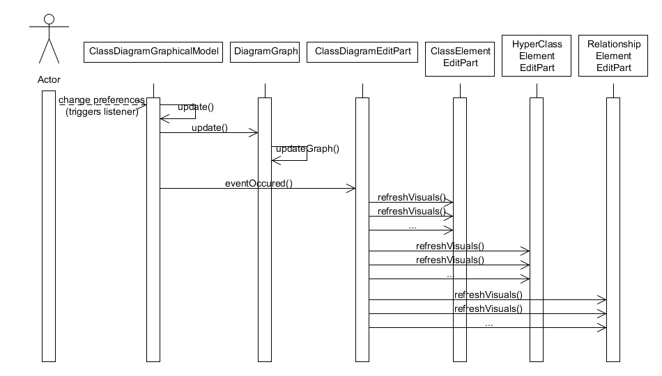
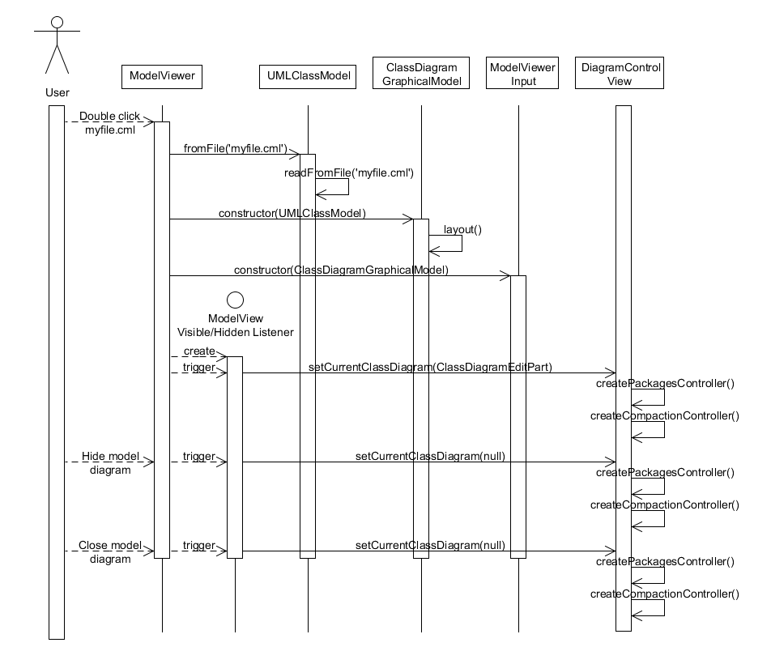

Onion Uml Visualization

Software Requirements Specification

Version 3

12/12/2013

Table of Contents
=================
* 1. INTRODUCTION

    * 1.1 PURPOSE
    * 1.2 SCOPE
    * 1.3 DATA DICTIONARY, ACRONYMS, AND ABBREVIATIONS
    * 1.4 REFERENCES
    
* 2. GENERAL DESCRIPTION

	* 2.1 PRODUCT PERSPECTIVE
	* 2.2 PRODUCT FUNCTIONS
	* 2.3 USER CHARETERISTICS
	* 2.4 GENERAL CONSTRAINTS
	* 2.5 ASSUMPTIONS AND DEPENDENCIES

* 3. SPECIFIC REQUIREMENTS

    * 3.1 EXTERNAL INTERFACE REQUIREMENTS
      * 3.1.1 User Interface
    * 3.2 FUNCTIONAL REQUIREMENTS
      * 3.2.1 Feature #1 - Zoom Shorcuts
      * 3.2.2 Feature #2 - Stereotype Display
      * 3.2.3 Feature #3 - Unique Stereotype Colors
      * 3.2.4 Feature #4 - Class Search Box
      * 3.2.5 Feature #5 - View Package Selector
      * 3.2.6 Feature #6 - Save Layout
    * 3.3 USE CASES
      * 3.3.1 Use Case #1
      * 3.3.2 Search Dialog 
    * 3.4 CLASSES/OBJECTS
      * 3.4.1 Class/Object #1
      * 3.4.2 Class/Object #2
    * 3.5 DESIGN CONSTRAINTS
    * 3.6 OTHER REQUIREMENTS
    
* 4 ANALYSIS MODELS

   * 4.1 SEQUENCE DIAGRAMS
   * 4.2 DATA FLOW DIAGRAMS(DFD)
   * 4.3 STATE TRNASITION DIAGRAMS(STD)
   
* 5 CHANGE MANAGMENT PROCESS

##1. Introduction

The OnionUmlVisualization is an Eclipse plug-in that reduce the number of visible 
classes in a UML class diagram while preserving structure and semantics of the UML
elements. The goal is that developers will be able to view and understand a 
subsystems of a large software while being able to visualize how that system fits 
into the whole system.

**1.1 PURPOSE**

Currently some of the functions of the plug-in does not work. The purpose of this 
project is to make some of the functions of the plug-in work and also if possible 
add some more functionalities.

**1.2 SCOPE**

Onion Uml Visualization is a Uml class diagram visualization program.
This Eclipse plug-in will allow a developer(user) to visualize and understand how
the subsystem of a larger software relates to the whole system. Relation among 
class and object in the system could also b seen too. This plug-in cannot display
these diagrams unless a .cml file has already been generated and then open in the
Onion Uml Visualization program.

**1.3 DATA DICTIONARY, ACRONYMS, AND ABBREVIATIONS**

.cml ClassML extension file.

**1.3.1 DATA DICTIONARY**

* RelationshipType (Types of Relationships)

	* Aggregation
	* Association
	* DirectedAssociation
	* Composition
	* Dependency
	* Realization
	* Generalization
	* Hyper_DirectedAssociation
	* Hyper_Composition
	* Hyper_Dependancy
	* Hyper_Realization
	* HyperGeneralization
	
* UmlClassElement: (Elements of classes)

	* Name
	* StereoType
	* Visiblity
	* isAbstract
	* Attributes
	* Operations
	
* UmlClassModel: (More elements of classes)

	* Packages
	* Relationships
	* Description
	
* UmlOperation: (Operation in UML class diagram)

	* Visibility
	* returnType
	* isStatic
	* isAbstract
	
* ModelViewer: (View and workspace of GUI)

	* Zoom_Levels
	
* PerspectiveFactory: (Layout of UML)

	* PageLayout
	
* ClassElementEditPart: (Layout for classes)

	* Color
	* Name_Font
	* Stereotype_Font
	* Name_Abstract_Font
	* Normal_Font
	* Abstract_Font
	* Static_Font
	
* RelationshipElementEditPart: (Layout for relationships)

	* Line_Dask_Style
	* Label_Distance
	
* ClassFigure: (Layout for classes)  

	* Font
	* Label
	* PropertiesFigure
	* OperationsFigure
	* OnionRelationshipsFigure
	
- edu.ysu.onionuml
	- Activator.java
		- mPlugin
		- PLUGIN_ID
		- getDefault()
		- getImageDescriptor(String)
		- Activator()
		- start(BundleContext)
		- stop(BundleContext)
		- compact
- edu.ysu.onionuml.compact
	- DiagramGraph.java
		- Node
		- mClassNodeMap
		- mElements
		- mRootNodes
		- addElement(ClassElementGraphicalModel)
		- addRelationship(RelationshipElementGraphicalModel, ClassElementGraphicalModel, ClassElementGraphicalModel)
		- update()
		- updateGraph()
- edu.ysu.onionuml.core
	- ClassmlWriter.java
		- XMLNS
		- write(UmlClassModel, String)
	- RelationshipType.java
		- AGGREGATION
		- ASSOCIATION
		- COMPOSITION
		- DEPENDENCY
		- DIRECTEDASSOCIATION
		- GENERALIZATION
		- HYPER_AGGREGATION
		- HYPER_ASSOCIATION
		- HYPER_COMPOSITION
		- HYPER_DEPENDENCY
		- HYPER_DIRECTEDASSOCIATION
		- HYPER_GENERALIZATION
		- HYPER_REALIZATION
		- REALIZATION
		- parseRelationshipType(String)
		- toString()
	- UmlAttribute.java
		- dataType
		- name
		- visibility
		- UmlAttribute(Visibility, String, String)
		- toString()
	- UmlClassElement.java
		- mAttributes
		- mIsAbstract
		- mName
		- mOperations
		- mStereotype
		- mVisibility
		- UmlClassElement()
		- UmlClassElement(String)
		- UmlClassElement(String, String)
		- addAttribute(UmlAttribute)
		- addOperation(UmlOperation)
		- getAttributes()
		- getIsAbstract()
		- getName()
		- getOperations()
		- getStereotype()
		- getVisibility()
		- setIsAbstract(boolean)
		- setName(String)
		- setStereotype(String)
		- setVisibility(Visibility)
		- toString()
	- UmlClassModel.java
		- fromFile(String)
		- mDescription
		- mName
		- mPackages
		- mRelationships
		- UmlClassModel(String)
		- UmlClassModel(String, String, Map<String, UmlPackageElement>, Map<String, UmlRelationshipElement>)
		- getDescription()
		- getName()
		- getPackages()
		- getRelationships()
		- readFromFile(String)
		- toFile(String)
	- UmlOperation.java
		- isAbstract
		- isStatic
		- name
		- parameters
		- returnType
		- visibility
		- UmlOperation(Visibility, String, String, boolean, boolean)
		- toString()
	- UmlOperationParameter.java
		- dataType
		- name
		- UmlOperationParameter(String, String)
		- toString()
	- UmlPackageElement.java
		- mClasses
		- mName
		- UmlPackageElement(String)
		- UmlPackageElement(String, Map<String, UmlClassElement>)
		- addClass(String, UmlClassElement)
		- getClasses()
		- getName()
		- setName(String)
	- UmlRelationshipElement.java
		- Multiplicity
		- mHeadId
		- mHeadMultiplicityMax
		- mHeadMultiplicityMin
		- mLabel
		- mTailId
		- mTailMultiplicityMax
		- mTailMultiplicityMin
		- mType
		- UmlRelationshipElement(String, String, String, RelationshipType)
		- UmlRelationshipElement(String, String, String, RelationshipType, Multiplicity, Multiplicity, Multiplicity, Multiplicity)
		- getHeadId()
		- getHeadMultiplicityMax()
		- getHeadMultiplicityMin()
		- getLabel()
		- getTailId()
		- getTailMultiplicityMax()
		- getTailMultiplicityMin()
		- getType()
		- setHeadId(String)
		- setHeadMultiplicityMax(Multiplicity)
		- setHeadMultiplicityMin(Multiplicity)
		- setLabel(String)
		- setTailId(String)
		- setTailMultiplicityMax(Multiplicity)
		- setTailMultiplicityMin(Multiplicity)
		- setType(RelationshipType)
	- UmlSaxHandler.java
		- mElementNames
		- mObjects
		- mPackages
		- mRelationships
		- mTitle
		- endElement(String, String, String)
		- getPackages()
		- getRelationships()
		- getTitle()
		- startElement(String, String, String, Attributes)
	- Visibility.java
		- PRIVATE
		- PROTECTED
		- PUBLIC
		- parseVisibility(String)
		- toString()
- edu.ysu.onionuml.ui
	- DiagramControlView.java
		- ID
		- PADDING
		- TEXT_COMPACT_ALL
		- TEXT_COMPACT_SELECTED
		- TEXT_COMPACTION_CONTROLLER
		- TEXT_EXPAND_ALL
		- TEXT_EXPAND_SELECTED
		- TEXT_NO_DIAGRAM
		- TEXT_PACKAGES_CONTROLLER
		- TEXT_RESET_ALL
		- TEXT_SELECT_ALL
		- TEXT_SELECT_NONE
		- mCompactionControlView
		- mCurrentClassDiagram
		- mDefaultView
		- mPackagesView
		- mPackageTable
		- mParentComposite
		- createCompactionController(Composite)
		- createDefaultView(Composite)
		- createPackagesController(Composite)
		- createPartControl(Composite)
		- getCurrentClassDiagram()
		- onCompactSelectedPressed()
		- onExpandSelectedPressed()
		- populatePackageTable()
		- setCurrentClassDiagram(ClassDiagramEditPart)
		- setFocus()
	- ModelViewer.java
		- ID
		- ZOOM_LEVELS
		- mEditorInput
		- mModel
		- ModelViewer()
		- configureGraphicalViewer()
		- createPartControl(Composite)
		- dispose()
		- doSave(IProgressMonitor)
		- doSaveAs()
		- getAdapter(Class)
		- init(IEditorSite, IEditorInput)
		- initializeGraphicalViewer()
		- isDirty()
		- isSaveAsAllowed()
	- ModelViewerActionBarContributor.java
		- buildActions()
		- contributeToToolBar(IToolBarManager)
		- declareGlobalActionKeys()
	- ModelViewerInput.java
		- mModelList
		- mNextId
		- mId
		- ModelViewerInput(ClassDiagramGraphicalModel)
		- dispose()
		- equals(Object)
		- exists()
		- getAdapter(Class)
		- getId()
		- getImageDescriptor()
		- getModel()
		- getName()
		- getPersistable()
		- getToolTipText()
	- PerspectiveFactory.java
		- BOTTOM_FOLDER_ID
		- BOTTOM_FOLDER_RATIO
		- PROJECT_EXPOLORER_RATIO
		- createInitialLayout(IPageLayout)
- edu.ysu.onionuml.ui.graphics
	- EditPartFactory.java
		- createEditPart(EditPart, Object)
	- IEventListener.java
		- eventOccured(String)
	- IEventRegistrar.java
		- registerEventListener(IEventListener)
		- unregisterEventListener()
- edu.ysu.onionuml.ui.graphics.editparts
	- ClassDiagramEditPart.java
		- EVENT_ACTIVATED
		- EVENT_REFRESH_REQUIRED
		- mSelectedClasses
		- activate()
		- addToSelection(ClassElementEditPart)
		- createEditPolicies()
		- createFigure()
		- deactivate()
		- eventOccured(String)
		- getDragTracker(Request)
		- getModelChildren()
		- getSelectedClasses()
		- lookupEditPartById(String)
		- removeFromSelection(ClassElementEditPart)
	- ClassElementEditPart.java
		- ABSTRACT_FONT
		- CLASS_COLOR
		- NAME_ABSTRACT_FONT
		- NAME_FONT
		- NORMAL_FONT
		- STATIC_FONT
		- STEREOTYPE_FONT
		- mDragLocation
		- activate()
		- createEditPolicies()
		- createFigure()
		- getDragTracker(Request)
		- mouseDoubleClicked(MouseEvent)
		- mouseDragged(MouseEvent)
		- mouseEntered(MouseEvent)
		- mouseExited(MouseEvent)
		- mouseHover(MouseEvent)
		- mouseMoved(MouseEvent)
		- mousePressed(MouseEvent)
		- mouseReleased(MouseEvent)
		- refreshVisuals()
	- HyperClassElementEditPart.java
		- createEditPolicies()
		- createFigure()
		- refreshVisuals()
	- RelationshipElementEditPart.java
		- LABEL_DISTANCE
		- LINE_DASH_STYLE
		- createEditPolicies()
		- createFigure()
		- getDragTracker(Request)
		- isSelectable()
		- makeHeadDecoration(RelationshipType)
		- makeMultiplicityString(Multiplicity, Multiplicity)
		- refreshVisuals()
- edu.ysu.onionuml.ui.graphics.figures
	- ClassFigure.java
		- mContentFont
		- mIsOnion
		- mNameLabel
		- mOnionRelationshipsFigure
		- mOperationsFigure
		- mPropertiesFigure
		- mStereotypeLabel
		- ClassFigure(Color, Font, Font, Font)
		- addOnionRelationship(RelationshipType)
		- addOperation(String, Image, Font)
		- addProperty(String, Image, Font)
		- clear()
		- getNameString()
		- getOperationIndex(int, int)
		- getOperationString(int)
		- getPropertyIndex(int, int)
		- getPropertyString(int)
		- getStereotypeString()
		- reconstruct()
		- setIsOnion(boolean)
		- setNameFont(Font)
		- setNameIcon(Image)
		- setNameString(String)
		- setStereotypeString(String)
	- ClassSectionFigure.java
		- SPACING
		- ClassSectionFigure(boolean)
	- OnionRelationshipFigure.java
		- BORDER_THICKNESS
		- CANVAS
		- LINE_DASH
		- mFillColor
		- mLine
		- mLinePoints
		- mPolygon
		- mRelationshipType
		- OnionRelationshipFigure(RelationshipType)
		- makeShapes(RelationshipType)
		- paint(Graphics)
		- primTranslate(int, int)
- edu.ysu.onionuml.ui.graphics.graphicalmodels
	- ClassDiagramGraphicalModel.java
		- NUM_CLASSES_FOR_HYPEREDGES
		- mClassIdMap
		- mClassModel
		- mClassSizeChanged
		- mDiagramGraph
		- mElements
		- mListener
		- mRelationshipIdMap
		- ClassDiagramGraphicalModel(UmlClassModel)
		- eventOccured(String)
		- getClassModel()
		- getElements()
		- initEdges()
		- layout()
		- layoutEdges(Map<String, ArrayList<String>>, RelationshipType)
		- lookupGraphicalModelById(String)
		- lookupIdByGraphicalModel(IElementGraphicalModel)
		- registerEventListener(IEventListener)
		- unregisterEventListener()
		- update()
	- ClassElementGraphicalModel.java
		- EVENT_SIZE_CHANGED
		- mActualHead
		- mChildRelationships
		- mClassElement
		- mIsCompacted
		- mIsHyper
		- mIsParentCompacted
		- mIsVisible
		- mListener
		- mPackageElement
		- mPosition
		- mSize
		- ClassElementGraphicalModel(UmlClassElement, UmlPackageElement)
		- getActualHead()
		- getChildRelationships()
		- getClassElement()
		- getPackageElemet()
		- getPosition()
		- getSize()
		- isCompacted()
		- isHyper()
		- isParentCompacted()
		- isVisible()
		- registerEventListener(IEventListener)
		- setChildRelationships(List<RelationshipType>)
		- setIsCompacted(boolean)
		- setIsHyper(boolean, ClassElementGraphicalModel)
		- setIsParentCompacted(boolean)
		- setIsVisible(boolean)
		- setPosition(Point)
		- setSize(Dimension)
		- unregisterEventListener()
	- IElementGraphicalModel.java
		- getPosition()
		- getSize()
		- setPosition(Point)
		- setSize(Dimension)
	- RelationshipElementGraphicalModel.java
		- mPosition
		- mRelationship
		- mSize
		- RelationshipElementGraphicalModel(UmlRelationshipElement)
		- getPosition()
		- getRelationshipElement()
		- getSize()
		- setPosition(Point)
		- setSize(Dimension)
- edu.ysu.onionuml.ui.handler
	- OpenClassModelCommandHandler.java
		- OPEN_DIALOG_TITLE
		- OPEN_FILTER_EXT
		- OPEN_FILTER_NAMES
		- addHandlerListener(IHandlerListener)
		- dispose()
		- execute(ExecutionEvent)
		- isEnabled()
		- isHandled()
		- removeHandlerListener(IHandlerListener)
		
**1.4 REFERENCES**

  * kagdi-VISSOFT07-Onion Graphs for Focus+Context Views of UML Class Diagrams
  * OnionUML Visualization Tool: Falcone-ICPC2013

##2. GENERAL DESCRIPTION

**2.1 PRODUCT PERSPECTIVE**

Current the application runs as an eclipse application which consumes a lot of memory. It is also not possible to install it a stand alone application or as  a plugin on other systems.

 The application requires a *.cml file (a ClassML file) as input. This is an XML file that contains the class model of the system. 
The .cml file is created outside the application and makes the Onion Uml  application have not influence on how it is been created.The *.cml file is created in the following manner.

   * Step 1: Find the system you want to see the visualization for. 
   * Step 2: Run src2srcML on the source directory. 
   * Step 3: run srcML2classML on the output of Step 2 and this will produce        the .cml file that the OnionUmlVisualization needs. 

All the above steps are done using in the eclipse environment and the utility is available at https://github.com/seresl/srcml2classml

The application establish relation among class and member using the hierarchical method

**2.2 PRODUCT FUNCTIONS**

  * View diagrams from  a ClassML file.
  * Search for packages a system when you open its ClassML file.
  * Change color of classes
  * View the class stereotype, field, and methods in the system. 
  * See the relationship among classes.
  * Select by dragging and compact classes
   
**2.3 USER CHARACTERISTICS**

**2.4 GENERAL CONSTRAINTS**

**2.5 ASSUMPTIONS AND DEPENDENCIES**

In other to use this application you have be within the eclipse environment

The application depends on the several eclipse plugins and also needs MxGraph to draw the classes and build the relationships 

##3. SPECIFIC REQUIREMENTS

Currently the application can only run on the Eclipse for RCP and RAP Developers, Kepler Release version

**3.1 EXTERNAL INTERFACE REQUIREMENTS**

**3.1.1 User Interface**

**3.2 FUNCTIONAL REQUIREMENTS**

These are propose requirement that would help make the application work better

**3.2.1 Feature #1**

- **Name:** 
**Zoom Shortcuts**

- **Description:**
User can zoom in or out using standard 'CTRL+' and 'CTRL-' or CTRL with Scroll Wheel

- **Implementation:** 
Zoom capability is already available from the Eclipse interface (currently using a eclipse ZoomManager Eclipse toolbar).
  
     -  Using MouseEventListener and keeping track of the MouseWheelMovement of the mousing. If the user hold down the Crtl key and moves the mouse wheel, it activates the ZoomListener and zoom in[out] is achieved.
 - Most of the coding is done but not all working.

- **Resources:**
   -  Existing Java class library. 

- **Estimated Time:** 
  - 3 hours to write the current code and x amount of time to get it all working 

**3.2.2 Feature #2**

- **Name:** 
**Stereotype Display**

- **Description:**
User can choose whether to display the stereotype in the class object above the class name as '&lt;&lt;stereotype>>'

- **Implementation:** 
    - Step 1. [COMPLETE] Create a preferences menu where the user can choose whether to display or hide class stereotypes.  This will be implemented as a new Eclipse PreferencePage or FieldEditorPreferencePage.

    - Step 2. Get every class opject to display the string '&lt;&lt;stereotype>>' above the class name.  (modifies onionuml.ui.graphics.figures.ClassFigure and possibly also onionuml.ui.graphics.editparts.ClassElementEditPart)

    - Step 3. Get the user preference for viewing stereotypes out of the Eclipse Preference Store and use it to display or hide the stereotype string.  (modifies same class(es) as Step 2, also consider building a new class that will return values from the Preference Store)

    - Step 4. Get stereotype name from .cml file and store as part of the class model.  Use this name to display the correct stereotype value for each class.  (modifies onionuml.core classes)

    - Step 5. We may need to build a .cml file for testing that has at least one of each stereotype represented.

- **Outstanding Questions**
How are stereotypes determined in the generation of the .cml file?  How are they represented in the .cml file?  Does the current model collect and store stereotype values, or will the model need to be modified to do so?

- **Estimated Time:** 
    - Step 1: 8 hours
    - Step 2: 1 hour
    - Step 3: 4 hours
    - Step 4: XX hours (time will be determined after outstanding questions are answered) 

**3.2.3 Feature #3**

- **Name:** 
**Unique Stereotype Colors**

- **Description:**
A user should be able to select the color scheme of the diagram. Certain classes or sets of classes that belong to a specific category (or stereotype) should be colored the same.  The default color scheme should be: (Stereoptype and RGB values)
    - Control - red 255 204 204
    - Boundary - blue 204 236 255
    - Entity - green 225 255 226
    - yellow for notes 255 255 226    

- **Dependencies**
requires functionality created in Feature 2 (Steps 1, 4 and 5)   
  
- **Implementation:** 
    - Step 1. [COMPLETE] Add elements to the preferences menu where the user can choose whether to show stereotypes in different colors and select which colors to use for each stereotype.  The default colors should be set to values in the table above. (modifies the Preferences package)

    - Step 2. Using the user's color preferences and the stereotype values for each class, assign the appropriate color to class objects.  (modifies onionuml.ui.graphics.figures.ClassFigure and possibly also onionuml.ui.graphics.editparts.ClassElementEditPart)

- **Estimated Time:** 
    - Step 1: 3 hours
    - Step 2: 10 hour

**3.2.4 Feature #4**

- **Name:** 
**Class Search Box**

- **Description:**
User can open a form for searching classes with Ctrl+F.  They will see a text box where they can enter a regular expression for searching class names.  Search results will appear as a list with checkboxes for each class.  When complete, a new diagram view will open with only the selected classes shown.

- **Implementation:** 

- **Estimated Time:** 

**3.2.5 Feature #5**

- **Name:** 
**View Package Selector**

- **Description:**
Currently, a select-able list of packages is shown in the Diagram Control View.  It  needs implementation for all of its functions to work. When a user deselects a package, the classes from that package should disappear from the diagram.  When a user re-selects a package, the classes should reappear.

- **Implementation:** 

- **Estimated Time:** 

**3.2.6 Feature #6**

- **Name:** 
**Save Layout**

- **Description:**
Users will be able to store a specific layout to a file.  The layout file will be saved and stored together with the .cml file.  Users will need both the layout and .cml (model) files to reopen a project layout later.

- **Implementation:** 

- **Estimated Time:** 

**3.2.7 Feature #7**

- **Name:**
**Create Update Site Package**

- **Description:**
User should be able to create an update to the packages in view.

- **Implementation:** 

- **Estimated Time:** 

**3.2.8 Feature #8**

- **Name:**
**Generate ClassML from Eclipse**

- **Description:**
User should be able to use the application to create the ClassML file where they would have control on the features they want to see in the ClassML file.

- **Implementation:** 

- **Estimated Time:**

**3.2.9 Feature #9**

- **Name:**
**Change Layout**

- **Description:**
The user should be able to change the layout of the diagrams. One layout should prioritize associations more than generalizations. This would be called the multi-cluster layout. Right now only hierarchical layout is possible (which favors generalizations/inheritance).

- **Implementation:** 

- **Estimated Time:**

**3.2.10 Feature #10**

- **Name:**
**Plugin Installation**

- **Description:**
User should be able to install this plugin from Eclipse. All
related libraries should also be installed at this point.

- **Implementation:** 

- **Estimated Time:** 
- 
**3.2.11 Feature #11**

- **Name:**
**Plugin Installation**

- **Description:**
User should be able to install this plugin from Eclipse. All
related libraries should also be installed at this point.

- **Implementation:** 

- **Estimated Time:** 

**3.3 USE CASES**

**3.3.1 Use Case #1**

**Use Case ID:** UC1  
**Use Case Name:** Select modules 

**Created By:** Samuel Addai
**Date Created:** 20 September 2013  

**Last Updated By:** Dominic Pascarella
**Last Revision Date:** 29 October 2013  

**3.2.12 Feature #12**

- **Name:**
**Layout Selection**

- **Description:**
The layout should be different for the UML diagram and for the onion notation. So a user should
be able to choose a different layout scheme for each.

- **Implementation:** 

- **Estimated Time:**

**3.2.13 Feature #13**

- **Name:**
**Graph auto update**

- **Description:**
Drawing area based on selection of packages and it should be auto update whenever there is a new selection of packages. 

- **Implementation:** 

- **Estimated Time:**

**3.2.14 Feature #14**

- **Name:**
**Select Relationship**

- **Description:**
In UML mode filtering should be possible for showing only certain types of relationships such as
associations, generalizations, and/or dependencies.

- **Implementation:** 

- **Estimated Time:**

**3.2.15 Feature #15**

- **Name:**
**Application Optimization**

- **Description:**
It is very slow in responding. Is there a way to optimize?

- **Implementation:** 

- **Estimated Time:**

**3.2.16 Feature #16**

- **Name:**
**Application Stability**

- **Description:**
It should not crash when use to visualize large systems with 300+ classes.

- **Implementation:** 

- **Estimated Time:**

**3.2.17 Feature #17**

- **Name:**
**Drawing output Warning**

- **Description:**
If the user wants to show too much data on the screen it should give them a warning that there is
way too much data here and give them a choice to continue or not continue with the selection. You
have to determine how much is too much.

- **Implementation:** 

- **Estimated Time:**

**3.2.18 Feature #18**

- **Name:**
**Fix All nonworking buttons**

- **Description:**
The compact all and expand all buttons don’t work.

- **Implementation:** 

- **Estimated Time:**

**3.2.19 Feature #19**

- **Name:**
**Movement of Relationship shouldn't affect the model**

- **Description:**
The relationships should be able to be moved if the user wishes but it is important to note that if
this is done the relationships be maintained between the classes in question. Because moving a
relationship by mistake would possibly invalidate the model.

- **Implementation:** 

- **Estimated Time:**

## Primary Actor
All users

## Story
A user loads a .cml file to see then uml diagrams of an existing system.

## Trigger
A user runs the OnioUmlVisualization plugin as an eclipse application, selects the Onion Uml perspective and open a .cml file

## Preconditions
* The user has all the plugins and the dependencies for the OnioUmlVisualization plugin to run properly installed.

* The user has a .cml file generated using the right method.

## Postconditions
The uml diagrams in the .cml are extracted and displayed

## Normal Flow
1. User  selects the onion uml perspective and opens a .cml file
2. System displays the diagrams in the .cml file in the display window
3. User selects modules 
4. User click on the UML Diagram control
5. Include :: Compress selected module. User click on Compress selected 
6. System compress the selected module

## Alternative Flows
#### Alternative Flow 1 – expand
* 3a  If selected module is already compressed
1. User click on the UML Diagram control
2. Include :: Expand modules. User click on Expand selected 
3. System compress the selected module
#### Alternative Flow 1 – move
* 3b
1. Include ::Move module 
2. System change position of the selected
## Frequency of Use
10
## Special Requirements
The .cml file must be generated using  the src2srcML and srcML2classML method
## Assumptions
The version of the eclipse can run the OnionUmlVisualization plugin

**3.3.2 Use Case #2**

**Use Case ID:** UC2  
**Use Case Name:** Search Dialog  

**Created By:** Braden Walters  
**Date Created:** 29 September 2013  

**Last Updated By:** Braden Walters  
**Last Revision Date:** 29 September 2013  

#### Actors:
Initialised by the Eclipse user. All input comes from the user and the data
which is extracted from the CML file.

#### Description:
The user can search by class name to return a list of resulting matches and then
specify the visibility of that class.

#### Trigger:
When the user strikes Control+F, the search window will open.

#### Preconditions:
1.  User has onion UML graph in focus.

#### Normal Flow:
1.  User strikes Control+F to launch search dialog.
2.  User enters search term into search box.
3.  User strikes the return key or the search button.
4.  System performs case insensitive partial-string search of all classes in the
    current class model.
5.  System displays results in grid with a check box near each entry (default:
    selected checkbox).
6.  User selects or unselects check boxes in result grid.
7.  Upon closing dialog, system updates visualisation to only show classes that
    have not been unselected.

#### Alternative Flows:
None

#### Exceptions:
None

#### Includes:
None

#### Frequency of Use:
To be determined.

#### Special Requirements:
1.  The system must be able to resolve searches in reasonable time.
2.  The system must be able to update the visualization in reasonable time.

#### Assumptions:
None

#### Notes and Issues:
None

**3.3.3 Use Case #3**
**Use Case ID:** UC3  
**Use Case Name:** Zoom

**Created By:** Brandi Stillman
**Date Created:** 21 October 2013

**Last Updated By:** Brandi Stillman
**Last Revision Date:** 13 November 2013

#### Actors:
User

#### Description:
The user can zoom in to focus on a more precise position in the diagram, or zoom out to view a larger portion of the diagram from further away. 

#### Trigger:
Triggered when the eclipse user holds Ctrl and scrolls a negative or position increment on the mouse wheel. 

#### Preconditions:
1.  User has onion UML graph in focus.

#### Normal Flow:
1.  User holds in the Control key. 
2.  User scrolls the mouse wheel up. 
3.  Diagram view Zooms In.

#### Alternative Flows:
1.  User holds in the Control key. 
2.  User scrolls the mouse wheel down. 
3.  Diagram view Zooms Out.

#### Exceptions:
1. Event will not work properly if diagram is not in focus.

#### Includes:
None

#### Frequency of Use:
To be determined.

#### Special Requirements:
1.  The eclipse user must have a fully functioning mouse wheel.
2.  The system must be able to update the visualisation in reasonable time.

#### Assumptions:
None

#### Notes and Issues:
None

**3.3.4 Use Case #4**

**Use Case ID:** UC4  
**Use Case Name:** Changing Preferences

**Created By:** Samuel Addai
**Date Created:** 30 October 2013

**Last Updated By:** Samuel Addai
**Last Revision Date:** 30 October 2013

#### Actors:
Eclipse User

#### Description:
The user can change the color of the classes,can show what to be visible. 

#### Trigger:
Triggered when the eclipse user clicks on window, select Preferences, select OnionUmlVisualization. 

#### Preconditions:
1.  User has onion UML graph in focus.

#### Normal Flow:
1.  User click on Window menu. 
2.  User scroll down and selects Preferences. 
3.  User click on OnionUmlVisualization.

#### Alternative Flows:
1.  None

#### Exceptions:
1. None.

#### Includes:
None

#### Frequency of Use:
To be determined.

#### Special Requirements:
1.  The system must be able to update the visualization in reasonable time.

#### Assumptions:
None

#### Notes and Issues:
None

**3.3.5 Use Case #5**
**Use Case ID:**  UC5
**Use Case Name:** Class selection  

**Created By:** Rahul Gaurav   
**Date Created:** September 29, 2013  

**Last Updated By:** Rahul Gaurav  
**Last Revision Date:** September 30, 2013  

#### Actors: User 

#### Description: 
Selecting classes either by clicking on it or by dragging mouse.

#### Trigger:
 Either clicking on a class or selecting a group of class

#### Preconditions: 
The uml diagram of the system is open in eclipse

#### Postconditions: 
The intended classes were selected

#### Normal Flow: 
The user left clicks on the classes to be selected.

#### Alternative Flows: 
The user can select more than one classes by right-clicking and dragging the mouse to select all of the intended classes

#### Exceptions:
1. The user double clicks on the class. This will not select the class but display properties of the class.
2. The user right clicks on the class. This will not select the class; instead it will give various option for the class.

#### Frequency of Use: 
Very frequent

#### Assumptions:
 The user is acquainted with eclipse IDE and working environment.

#### Notes and Issues:
 Make use-case for double clicking and right clicking on the class.  

**3.3.6 Use Case #6**
**Use Case ID:** UC6  
**Use Case Name:** Open the UML Model View

**Created By:** John Meinken  
**Date Created:** 10/30/2013 

**Last Updated By:**   
**Last Revision Date:**  

#### Actors:
all users

#### Description:
Import a CML file into Eclipse and open the OnionUML model view for the file

#### Trigger:
First step when using the OnionUML tool.

#### Preconditions:

1.  User has already generated a CML file using srcml2classml.jar or similar tool.
2.  User has the OnionUML Eclipse plugin installed.
3.  User has the Onion UML Perspective open.

#### Normal Flow:

1.  User import the CML file into Eclipse  
	1.1  Right-click on the project folder in the Project Explorer  
	1.2  Select Import > General> File System  
	1.3  Navigate to the directory where the CML file is located  
	1.4  Select the CML file and click 'Finished'  
	1.5  The CML file will now be added to the project and visible in the Project Explorer  
2.  User double-clicks on the CML file  
3.  System displays the Onion UML model, populates the Diagram Control View with the appropriate options and adds a zoom control tool to the Eclipse action bar. 
4.  User has access to model and can perform all available actions related to that model.

#### Exceptions:
[Describe any anticipated error conditions that could occur during execution
of the use case, and define how the system is to respond to those conditions.
e.g. Exceptions to the Withdraw Case transaction  

* 2a. In step 2 of the normal flow, if the CML file has errors

	1.  Parse error is displayed

#### Frequency of Use:
Every time the plugin is used

#### Assumptions:
* User knows how to install and use the OnionUML plugin.
* User is able to generate a CML file.

#### Notes and Issues:

1.  Currently if the UML Diagram Control is not already open, clicking the CML file in step 2 does not open it.

**3.3.7 Use Case #7**
**Use Case ID:** UC7  
**Use Case Name:** Save Layout  

**Created By:** John Meinken  
**Date Created:** 10/30/13  

**Last Updated By:**  
**Last Revision Date:**   

#### Actors:
all users 

#### Description:
The CML file only contains the UML model, not the layout.  This use case enables the user to save a separate layout file that can later be reopened together with its corresponding CML file.

#### Trigger:
When a new OnionUML model is opened from a CML file, it initializes to a default layout.  As soon as this initial layout is modified by the user (by moving classes or relationships, compacting a group of classes into OnionUML format, etc.), this use case can be used.

#### Preconditions:

1.  User has opened a UML Model View from a CML file in Eclipse

#### Normal Flow:

1.  User modifies the model view layout (see UC1, UC2, UC5)
2.  System displays a * character after the model name in the UML model View selection tab, indicating that the view has changed and can be saved.
3.  User uses the Eclipse menu to select File > Save / Save As / Save All
4.  A dialog box will prompt the user for the layout file name.
5.  User enters the desired layout file name.
6.  System saves the layout under the provided file name with ".onion" as the file extension.
7.  System changes the model name in the UML model View selection tab from the .CML file name to the newly created .ONION file name.
8.  System removes the * character from the UML model View selection tab, indicating that there are no new changes to the layout since the last save.

#### Alternative Flows:

##### [Alternative Flow 1 – Already Saved as .ONION file]

* 3a.  In step 3 of the normal flow, if user selects Save or Save All and the .onion file already exists

	1.  Use Case resumes on step 6 (skip steps 4 and 5)

#### Exceptions:  

* 5a.  In step 5 of the normal flow, if user enters a layout name that already exists 

	1.  System prompts user if they would like to overwrite the existing file.
	2.  If yes, Use Case  resumes on step 6.  If no, Use Case resumes on step 4.

#### Includes:
Includes any use cases that modify the layout.  Currently, Use Cases UC1, UC2 and UC5.

#### Notes and Issues:

1.  What is the best extension for the layout file?  I put .onion, but that might not be the best choice.

##3.4 CLASSES/OBJECTS##

# OnionUmlVisualization Class Diagrams #
---
### Diagram 1: System Overview ###

### Diagram 2: Shows how the onionuml base class and ui package extend and implement Eclipse libraries ###

- **AbstractUIPlugin** - Abstract base class for plug-ins that integrate with the Eclipse platform UI

- **ViewPart** - Abstract base implementation of all workbench views

- **IPerspectiveFactory** - Generates the initial page layout and visible action set for a page

- **GraphicalEditor** - Creates an Editor containing a single GraphicalViewer as its control. 

- **ActionBarContributor** - Contributes actions to the workbench

***
### Diagram 3: Shows how the onionuml.ui.graphics package extends and implements Eclipse libraries ###

- **EditPartFactory** - Creates new EditParts

- **EditParts** - the building blocks of GEF Viewers. As the Controller, an EditPart ties the application's model to a visual representation. EditParts are responsible for making changes to the model. EditParts typically control a single model object or a coupled set of object. Visual representations include Figures and TreeItems. Model objects are often composed of other objects that the User will interact with. Similarly, EditParts can be composed of or have references to other EditParts. 

- **AbstractGraphicalEditPart** - the default implementation for GraphicalEditPart, which is a specialized EditPart for use with graphical viewers.
- **GraphicalEditParts** - specialized EditParts for use with graphical viewers

- **Figure** - The base implementation for graphical figures

***
### Diagram 4: Class model for onionuml core classes ###

##3.5 DESIGN CONSTRAINTS##

##3.6 OTHER REQUIREMENTS##
    
##4 ANALYSIS MODELS##

# 4.1 Sequence Diagrams#
---
## Use Case 4 - Changing Preferences ##

**Notes**

DiagramGraph.updateGraph() uses ClassElementGraphicalModel and RelationshipElementGraphicalModel to update all the elements for the class diagram.  This part is not shown because it makes the diagram too complicated.

refreshVisuals() is run for every element in the diagram.

## Use Case 6 - Opening and Closing The UML Model View ##

**Notes**

This sequence diagram does not show the display of the zoom selector in the Eclipse Action Bar.  This separate process is handled by the ModelViewerActionBarContributor class.  Its behavior is defined in the plugin.xml file.  The zoom selector is shown when a OnionUML model is visible.  Otherwise, it is hidden.  

The UML Diagram Control View is automatically opened and displayed when the Onion UML perspective is loaded, not when a model view is created.  If it is closed manually, it will not reopen automatically.  To reopen, the user has to manually reopen by selecting Window -> Show View -> Other -> Other -> UML Diagram Control.

**4.2 DATA FLOW DIAGRAMS(DFD)**

# OnionUmlVisualization Statechart Diagrams #
---

### Diagram 1: Whole System ###

  
####5 CHANGE MANAGMENT PROCESS
 