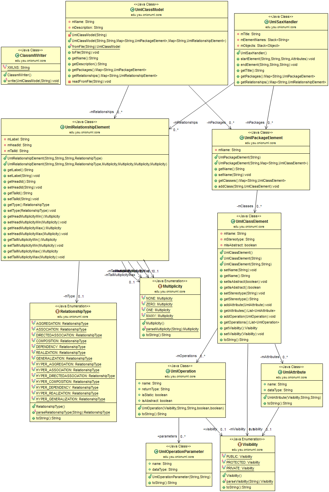

# OnionUmlVisualization Class Diagrams #
---
### Diagram 1: System Overview ###

### Diagram 2: Shows how the onionuml base class and ui package extend and implement Eclipse libraries ###

- **AbstractUIPlugin** - Abstract base class for plug-ins that integrate with the Eclipse platform UI

- **ViewPart** - Abstract base implementation of all workbench views

- **IPerspectiveFactory** - Generates the initial page layout and visible action set for a page

- **GraphicalEditor** - Creates an Editor containing a single GraphicalViewer as its control. 

- **ActionBarContributor** - Contributes actions to the workbench

***
### Diagram 3: Shows how the onionuml.ui.graphics package extends and implements Eclipse libraries ###

- **EditPartFactory** - Creates new EditParts

- **EditParts** - the building blocks of GEF Viewers. As the Controller, an EditPart ties the application's model to a visual representation. EditParts are responsible for making changes to the model. EditParts typically control a single model object or a coupled set of object. Visual representations include Figures and TreeItems. Model objects are often composed of other objects that the User will interact with. Similarly, EditParts can be composed of or have references to other EditParts. 

- **AbstractGraphicalEditPart** - the default implementation for GraphicalEditPart, which is a specialized EditPart for use with graphical viewers.
- **GraphicalEditParts** - specialized EditParts for use with graphical viewers

- **Figure** - The base implementation for graphical figures

***
### Diagram 4: Class model for onionuml core classes ###

