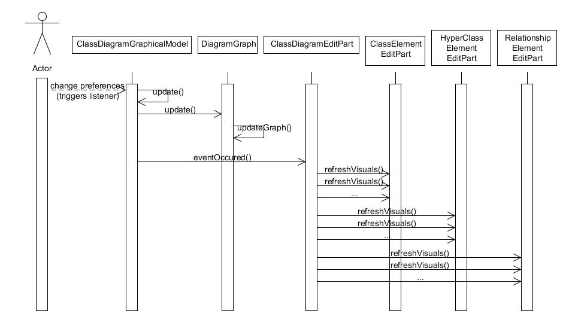
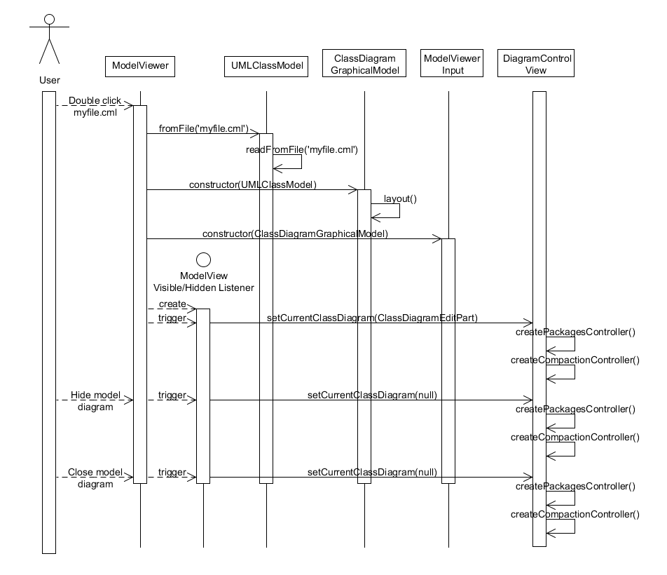

#Sequence Diagrams#
---
## Use Case 4 - Changing Preferences ##

**Notes**

DiagramGraph.updateGraph() uses ClassElementGraphicalModel and RelationshipElementGraphicalModel to update all the elements for the class diagram.  This part is not shown because it makes the diagram too complicated.

refreshVisuals() is run for every element in the diagram.

## Use Case 6 - Opening and Closing The UML Model View ##

**Notes**

This sequence diagram does not show the display of the zoom selector in the Eclipse Action Bar.  This separate process is handled by the ModelViewerActionBarContributor class.  Its behavior is defined in the plugin.xml file.  The zoom selector is shown when a OnionUML model is visible.  Otherwise, it is hidden.  

The UML Diagram Control View is automatically opened and displayed when the Onion UML perspective is loaded, not when a model view is created.  If it is closed manually, it will not reopen automatically.  To reopen, the user has to manually reopen by selecting Window -> Show View -> Other -> Other -> UML Diagram Control.

